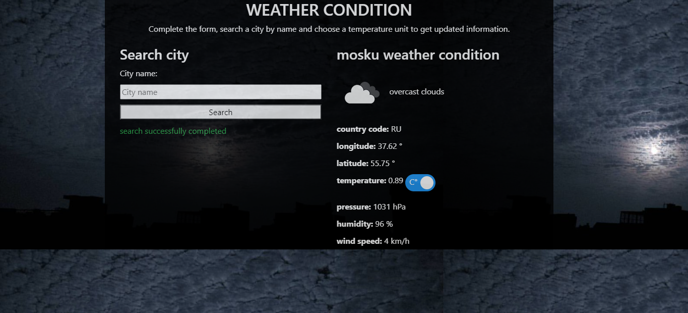

# Weather app Project

Fourth JavaScript Microverse Project By Oscar Russi

# What it does

- The website was built with JavaScript, Webpack, and Open Weather API
- You can search for weather condition of any city
- The index page has a form to search a city and select unit format for temperature information
- The output for the search will give a list of related data to the city's weather: temperature, wind speed, pressure, humidity.
- Output shows an icon to represent the cloud condition of the city, it also updates the background image of the page.
- The current project uses async methods, promises, and ECMA Script 6

# Build with

- HTML5/CSS
- JavaScript
- Webpack
- Bootstrap
- OpenWeather API: https://openweathermap.org/api

# Live demo

[Live Demo](https://andresporras3423.github.io/weather-app/dist/index.html)

# How to run this project

- Download this project or install running the next command in the terminal: git clone https://github.com/andresporras3423/weather-app.git  
- Move to the weather-app folder
- In the terminal, run: npm install
- In the terminal run: npm run start
- Open in a browser the dist/index.html file

#### and deployed to GitHub

## Authors

**Oscar Russi**
- Github: [@andresporras3423](https://github.com/andresporras3423/)
- Linkedin: [Oscar Russi](https://www.linkedin.com/in/oscar-andres-russi-porras)

## � Contributing

This is a project for educational purposes only. We are not accepting contributions.

## Attributions and Credit

Special thanks to Microverse, for this learning opportunity. 

## Show your support

Give a ⭐️ if you like this project!

## Enjoy!